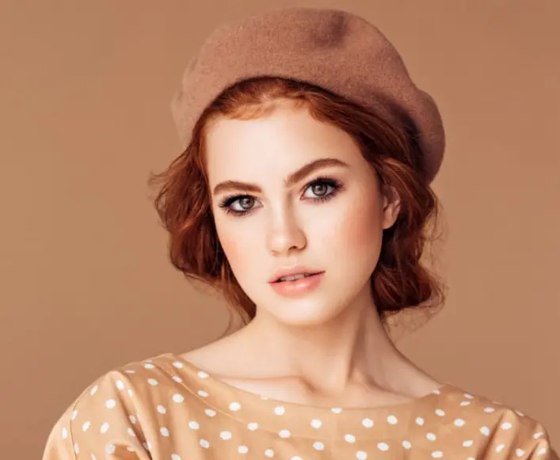
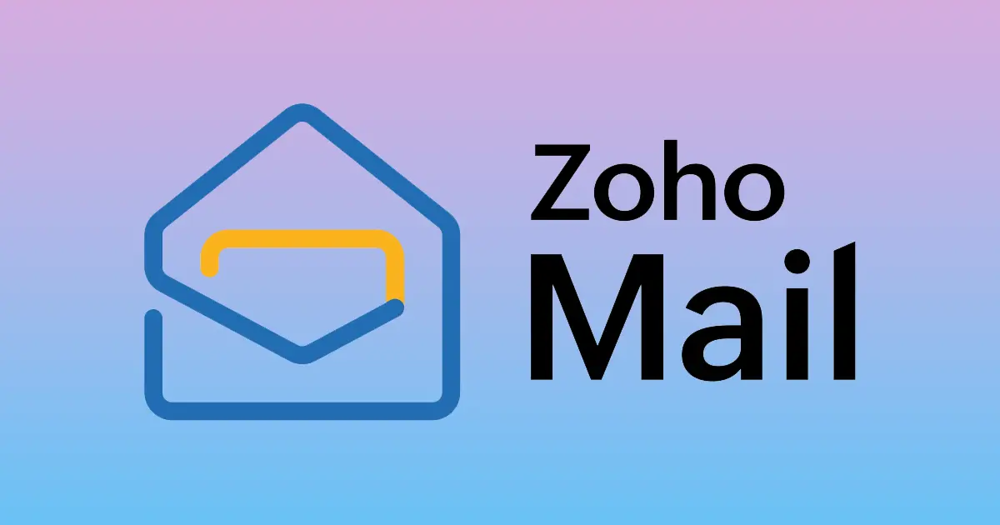

# Elevate Your Modeling Career with @fashionmodel.me 💼

### Stand Out with a Professional Email: **firstname@fashionmodel.me**

In the competitive world of modeling, first impressions matter. With an @fashionmodel.me email, you’ll make every professional interaction count, boosting your credibility and strengthening your personal brand.

---

### 🌟 Limited Time Offer: Only £0.99/month

Secure your professional email address for **£0.99/month**, with a **30-day money-back guarantee**. This small investment can give you the professional edge you need to stand out to agencies, casting directors, and industry insiders.

---
## 🌟 Why Choose @fashionmodel.me?

- **23% Higher Response Rate** from Agencies 📈
- **35% Better Recognition** by Casting Directors 👁️
- **Join Over 1000 Models** Worldwide 🌍

With @fashionmodel.me, each email showcases your professionalism, setting you apart in the industry.

---

### Choose Your Email Style

Pick a format that reflects your brand:

- `firstname@fashionmodel.me`
- `firstname.lastname@fashionmodel.me`
- `firstnamelastname@fashionmodel.me`

---

## 💸 Special Pricing Plans

Select the plan that works best for you, with discounted rates for long-term options:

| Plan                | Duration     | Total Cost    | Monthly Equivalent |
|---------------------|--------------|---------------|---------------------|
| **Monthly Plan**    | 1 month      | £1.99         | £1.99              |
| **1-Year Plan**     | 12 months    | **£21.49** (10% off) | **£1.79** |
| **2-Year Plan**     | 24 months    | **£38.21** (20% off) | **£1.59** |
| **5-Year Plan**     | 60 months    | **£47.76** (60% off) | **£0.80** |

---

## 📦 Premium Features Included (Powered by Zoho Mail) 🚀

Each @fashionmodel.me subscription brings you Zoho Mail’s powerful suite of tools, tailor-made to elevate your modeling career:

- **🔒 Secure and Expandable Storage**: Keep all your vital files, portfolios, and correspondence safe with Zoho’s encrypted storage, designed to grow with your career.
    
- **📱 Zoho Mail Mobile App**: Stay connected on the go with the Zoho Mail app! Available on iOS and Android, the app keeps you in touch with agencies, casting directors, and industry contacts, wherever you are.
    
- **🗓️ Smart Calendar Integration**: Manage castings, meetings, and important deadlines effortlessly! Zoho’s calendar, with customizable reminders, helps you stay on track and fully prepared for every opportunity.
    
- **✍️ Customizable Email Signatures**: Make a lasting impression with professional, stylish email signatures. Choose from various templates and include links to your portfolio, social media, or personal website for added flair.
    
- **🚫 Ad-Free Experience & 🌟 24/7 Priority Support**: Enjoy a distraction-free, ad-free inbox backed by Zoho’s 24/7 priority support. You’re never alone with real-time assistance whenever you need it!
    
- **👥 Enhanced Collaboration with Streams**: Turn email threads into discussion boards with Zoho’s “Streams.” Collaborate easily, get feedback, and stay organized across projects—all within your inbox!
    
- **🌐 Offline Access**: Need access on the move? With Zoho Mail’s offline mode, view your emails and attachments even without an internet connection, ensuring you’re always in control.

---

## ✨ Everything You Need to Succeed

Your @fashionmodel.me email is more than an address—it’s a tool for growth:

- **Higher Agency Response Rates** with a professional first impression
- **Streamlined Portfolio Sharing** to facilitate easy connections
- **Enhanced Digital Presence** that reinforces your brand across platforms

---

### Ready to Take Your Modeling Career to New Heights? 🚀

With an @fashionmodel.me email, you’ll gain the industry’s attention and build a strong professional brand from day one. **Start your journey today**.

📬 **For inquiries and reservations, contact us at:** info@fashionmodel.me
